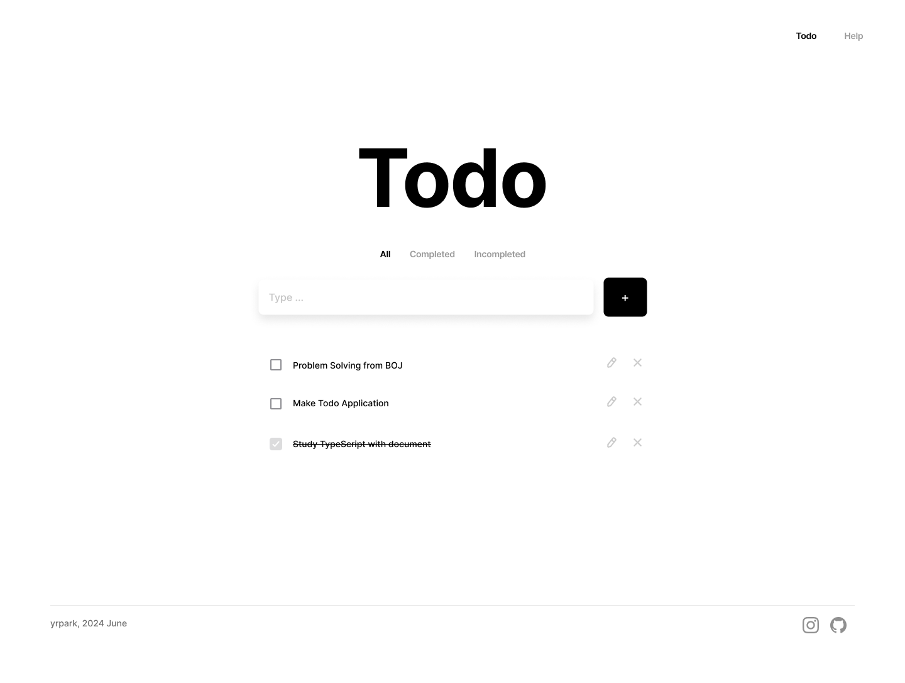

## 환경

- 프론트 : 
- 백엔드 :  
 

## 목표

- CRUD 기능 구현
- 재접속 시에도 데이터가 남아있도록 LocalStorage와 Node.js+Express 두 방식으로 각각 적용
- 메인 페이지와 Help 페이지를 라우팅(Reduct)
- PWA로 모바일에서도 예쁘게 보이게 만들어보기

 

## 목업

 

## 개발

### 구현 기능

- 항목 추가
- 항목 상태 변경 (완료 / 미완료)
- Todo, Help 페이지 라우팅
- 리스트 필터링
- 항목 제거
- 완료 구역 나누기
- 항목 내용 수정 구현(모달)
- 선택한 탭 활성화 처리

